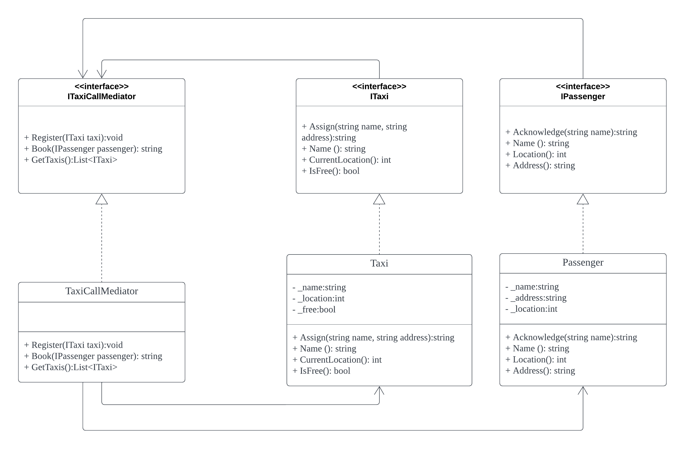

# Mediator-design-pattern

The Mediator design pattern is a behavioral design pattern that promotes loose coupling among a group of objects by centralizing communication between them. It provides a way to reduce the direct dependencies between objects and promotes a more organized and maintainable codebase. The Mediator pattern is particularly useful in scenarios where a set of objects need to communicate with each other, but you want to avoid the complexities of direct communication between them.
There are a lot of plcaes where you can see the Mediator design pattern being used in real life -  

- Chatting platfroms like Facebook
- Traffic control rooms at airports
- In Cab Call centers

In this case, I have tried to demonstrate the use of the Mediator design pattern in the case of Taxi call centers. 

# Approach

Here we take the example of booking a cab and assigning it to a passenger. We calculate the shortest distance of the cab from the person and then assign the nearest cab to the person. However, in my case, for simplicity I have taken the distance in miles although the better way will be to consider the location using latitudes and longitudes. We have 2 classes taxi and passenger that have to communicate with each other using a mediator.

# Design  

In the design, the mediator class is utilized in unit tests directly, the collegue1 : Taxi and collegue2 : Passenger communicates with each other through mediator hence mediator can call and access Taxi and Passenger class functions. 

